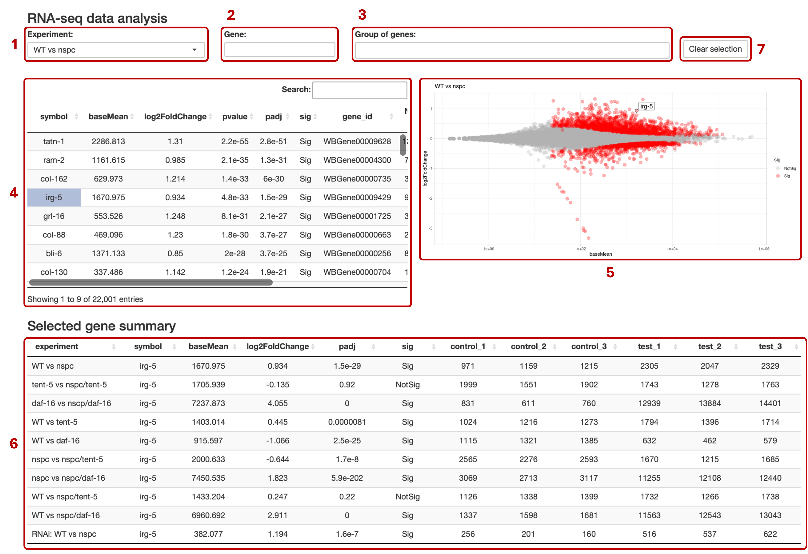

Introduction
---
This manual describes the functionality of data analysis tools designed for quicker and easier
management of large-scale datasets obtained through RNA sequencing. The series of data
analysis tools contains five R shiny applications with following purposes:

**1. RNA-seq data analysis**

This tool provides a robust and clear visualization of gene expression or poly(A) tail length
changes and allows to capture similarities and differences in transcriptomic signatures
across multiple conditions for a single gene or group of genes.

**2. Visualization of gene groups**

This extension of the first tool allows to screen the differential expression or
polyadenylation results for changes in characteristic gene groups, for example genes
enriched in individual cells or associated to specific physiological processes.

**3. qPCR analysis**

Third tool uses the built-in script to analyze RT-qPCR results using 2-ΔΔCt method using
only an output file from the thermocycler.

**4. Comparisons of gene groups**

This tool identifies and visualize genes overlapping between two gene groups.

**5. Translation of gene names**

The last tool allows the quick translation between alternative gene identifiers – gene name,
transcript name, and WormBase ID.

How to start
---
The applications can be accessed in two different ways:

**1. Web Access via URL**

The easiest method is to access the apps online through the URL provided below. However, in
this format, the applications will load only with default datasets described in the PhD thesis
“…”.

**URL:** *http://212.87.21.131/nanopore2/Zuza/*

**2. R Studio Access**

For users who wish to customize the applications or analyze their own datasets, the raw code is
available in this repository. Each application is organized in its
own folder. By downloading the folder and opening it in R Studio, users can run the
corresponding R Shiny file locally and later modify the app according to their needs.

Detailed description of data analysis tools functionality
---
**Tool nr 1 – RNA-seq data analysis**

The first tool is designed to visualize datasets obtained using Illumina or Nanopore RNA
sequencing and compare changes in gene expression levels or differences in poly(A) tail lengths
across multiple conditions.

The tool for **RNA-seq data analysis** is depicted below and consists of the following:

**(1) Experiment** list for choosing the dataset that user wants to explore. The list of datasets is
built into each R shiny app and can be changed only in the application’s code. The input
should be structured as a table containing analyzed sequencing data, obligatorily with
averaged normalized counts and log2 fold change of gene expression or poly(A) length
difference between control and tested condition.

**(2) Gene** window for searching a singular gene or family of genes. As a result, all genes
containing the typed-in phrase will show up on the **(5) MA plot**. Sometimes, a few gene
families have the same phrase in their names, causing some unwanted genes to be marked.
The user can limit the search by typing ^ symbol before or $ symbol after the desired
name.

**(3) Group of genes** window for exploring not only genes from the same family but also genes
interlinked, for example, by their function or site of expression. Gene names can be entered
manually or copied into the window, preferably from an Excel sheet. Although, there is no
limit to the number of genes that can by visualized simultaneously, the app works smoothly
for up to 1000 genes. Both this window and the **(2) Gene** window are case-sensitive, and
gene names need to be entered exactly as they appear in the *C. elegans* reference.

**(4) Table** representing all the statistics calculated for chosen comparison and can be sorted by
any column. Additionally, by clicking on a gene symbol, the user can select genes to be
visualized on the **(5) MA plot**.

**(5) MA plot** showing a differential expression or differential polyadenylation between
conditions in the chosen experiment. The “x” axis corresponds to log10 mean expression
level, and “y” to log2 fold change expression change. Significantly changed genes appear
as red dots, and not significantly as gray. All selected or typed genes are marked with black
borderlines and additional labels, as long as these labels do not disrupt plot’s clarity.

**(6) Selected gene summary** presenting how the expression of a chosen gene changes across
all experiments listed in the **(1) Experiment** list. This allows for a comprehensive analysis
of a single gene without the need to jump between different plots.

**(7) Clear selection** button for restarting the gene search by emptying both the **(2) Gene** and
the **(3) Group of genes** windows, and unselecting genes chosen by clicking in the **(4)
Table**.

