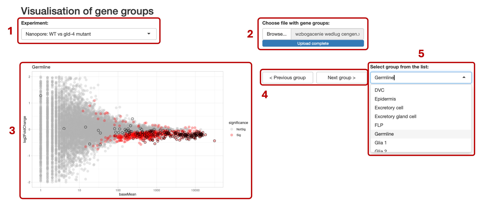
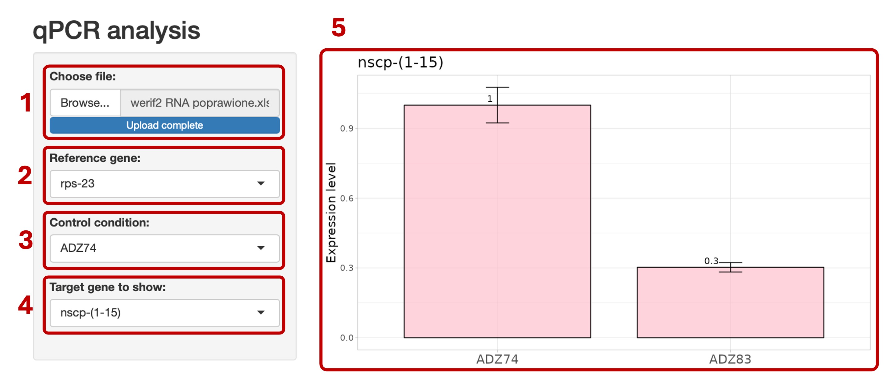
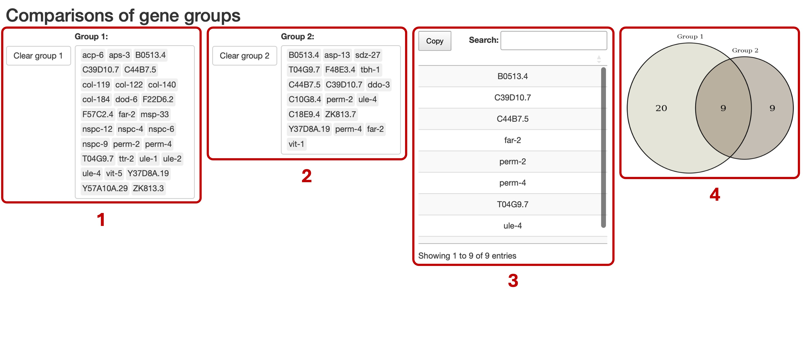

Introduction
---
This manual describes the functionality of data analysis tools designed for quicker and easier management of large-scale datasets obtained through RNA sequencing. The series of data analysis tools contains five R shiny applications with following purposes:

**1. RNA-seq data analysis**

This tool provides a robust and clear visualization of gene expression or poly(A) tail length changes and allows to capture similarities and differences in transcriptomic signatures across multiple conditions for a single gene or group of genes.

**2. Visualization of gene groups**

This extension of the first tool allows to screen the differential expression or polyadenylation results for changes in characteristic gene groups, for example genes enriched in individual cells or associated to specific physiological processes.

**3. qPCR analysis**

Third tool uses the built-in script to analyze RT-qPCR results using 2-ΔΔCt method using only an output file from the thermocycler.

**4. Comparisons of gene groups**

This tool identifies and visualize genes overlapping between two gene groups.

**5. Translation of gene names**

The last tool allows the quick translation between alternative gene identifiers – gene name, transcript name, and WormBase ID.

How to start
---
The applications can be accessed in two different ways:

**1. Web Access via URL**

The easiest method is to access the apps online through the URL provided below. However, in this format, the applications will load only with default datasets described in the PhD thesis “…”.

**URL:** *http://212.87.21.131/nanopore2/Zuza/*

**2. R Studio Access**

For users who wish to customize the applications or analyze their own datasets, the raw code is available in this repository. Each application is organized in its own folder. By downloading the folder and opening it in R Studio, users can run the corresponding R Shiny file locally and later modify the app according to their needs.

Detailed description of data analysis tools functionality
---
**Tool nr 1 – RNA-seq data analysis**

The first tool is designed to visualize datasets obtained using Illumina or Nanopore RNA sequencing and compare changes in gene expression levels or differences in poly(A) tail lengths across multiple conditions.

The tool for **RNA-seq data analysis** is depicted below and consists of the following:

**(1) Experiment** list for choosing the dataset that user wants to explore. The list of datasets is built into each R shiny app and can be changed only in the application’s code. The input should be structured as a table containing analyzed sequencing data, obligatorily with averaged normalized counts and log2 fold change of gene expression or poly(A) length difference between control and tested condition.

**(2) Gene** window for searching a singular gene or family of genes. As a result, all genes containing the typed-in phrase will show up on the **(5) MA plot**. Sometimes, a few gene families have the same phrase in their names, causing some unwanted genes to be marked. The user can limit the search by typing ^ symbol before or $ symbol after the desired name.

**(3) Group of genes** window for exploring not only genes from the same family but also genes interlinked, for example, by their function or site of expression. Gene names can be entered manually or copied into the window, preferably from an Excel sheet. Although, there is no limit to the number of genes that can by visualized simultaneously, the app works smoothly for up to 1000 genes. Both this window and the **(2) Gene** window are case-sensitive, and gene names need to be entered exactly as they appear in the *C. elegans* reference.

**(4) Table** representing all the statistics calculated for chosen comparison and can be sorted by any column. Additionally, by clicking on a gene symbol, the user can select genes to be visualized on the **(5) MA plot**.

**(5) MA plot** showing a differential expression or differential polyadenylation between conditions in the chosen experiment. The “x” axis corresponds to log10 mean expression
level, and “y” to log2 fold change expression change. Significantly changed genes appear as red dots, and not significantly as gray. All selected or typed genes are marked with black borderlines and additional labels, as long as these labels do not disrupt plot’s clarity.

**(6) Selected gene summary** presenting how the expression of a chosen gene changes across all experiments listed in the **(1) Experiment** list. This allows for a comprehensive analysis of a single gene without the need to jump between different plots.

**(7) Clear selection** button for restarting the gene search by emptying both the **(2) Gene** and the **(3) Group of genes** windows, and unselecting genes chosen by clicking in the **(4) Table**.

For clarity, the datasets from the PhD thesis “...” – available at the provided URL and GitHub repository – have been organized into three separate applications, each focusing on different part of the research. The first app focuses on differential gene expression in worms after the excretory gland cell ablation, second app on differential expression in nspc mutant worms, and the third app on differential polyadenylation driven by various poly(A) polymerases.

**Tool nr 2 – Visualization of gene groups**

The second tool enables robust screening of differential expression or polyadenylation results for changes in specific gene groups, which could suggest potential functions of the studied tissue or protein. Its design is similar to the first tool and uses the same input files containing analyzed RNA sequencing data.

The tool for **Visualization of gene groups** is depicted below and consists of the following:

**(1) Experiment** list for choosing the conditions for which the user wants to perform a screening. In this version of the app, the user needs to select only one experiment for analysis at the beginning, as changing experiments during the screening significantly slow down the app. To change the experiment, the app must be restarted.

**(2) Choose file with gene groups** browser for uploading an Excel file with gene groups for screening. The table should provide groups of genes segregated into columns with headers defining each group. Groups can, for example, represent genes enriched in individual cells.

**(3) MA plot** showing differential expression or polyadenylation, similarly to the previous tool. Black borderlines are added for the genes included in the selected gene group.

**(4) Previous** and **next group** buttons for easy screening through all groups defined in the uploaded table.

**(5) Select group from the list** for visualizing genes for a specific group without the need to process through all the groups in the table.

**Tool nr 3 – qPCR analysis**

The third tool allows to automate the process of the RT-qPCR results analysis using 2-ΔΔCt method. Currently, the tool is adapted to work with output files from the QuantStudio 5
thermocycler, but with minor modifications to the code, it can easily be adapted for use with data from other devices.

The tool for **qPCR analysis** is depicted below and consists of the following:

**(1) Choose file** browser for selecting the file containing the RT-qPCR results. After a successful upload, a **(5) Bar plot** will appear on the right side of the screen showing the analyzed data. For the file to work correctly, gene names need to be defined already in the QuantStudio software, and biological replicates must be defined as a number separated from the condition name with a space.

**(2) Reference gene** list for choosing which gene should be treated as the reference gene (ideally a housekeeping gene whose expression remains constant in across conditions).

**(3) Control condition** list summarizing different conditions run on the RT-qPCR plate and allowing to select the internal control for analysis (ideally a sample from wild-type or untreated worms).

**(4) Target gene** list allowing to screen through the various target genes for which reactions were run together on the plate.

**(5) Bar plot** representing the final results, including the calculated mean Ct value with standard deviation error bars for each condition.

**Tool nr 4 – Comparisons of gene groups**

The fourth tool can be used to identify genes overlapping between two gene groups.

The tool for **Comparisons of gene groups** is depicted below and consists of the following:

**(1) Group 1** window for entering the first group of genes. Gene names can be entered manually or copied into the window, preferably from an Excel sheet. It can be later cleared with the button on the left side.

**(2) Group 2** window for entering the second group of genes. As long as both groups are entered consistently, the app accepts any type of gene identifiers. For optimal performance, it is recommended to use groups containing fewer than 1 000 genes.

**(3) Table** listing all mutual genes present in both groups, that can be copied for further analyses.

**(4) Venn diagram** providing a visual representation of the overlap.

**Tool nr 5 – Translation of gene names**

The fifth tool aims at simplifying the translation between three alternative gene identifiers: gene name, transcript name and WormBase ID.

The tool for **Translation of gene names** is depicted below and consists of the following:

**(1) Genes to translate** window for entering names of genes for translation. Gene names in any form can be entered manually or copied into the window, preferably from an Excel sheet.

**(2) Translate into WormBase ID** and **Translate into symbol** buttons for converting inserted genes into the respective format, **Whole translation** button for showing all three types of identifiers for each gene, and Clear button for restarting the analysis.

**(3) Table** displaying list of translated genes, which can be copied for subsequent analyses.

